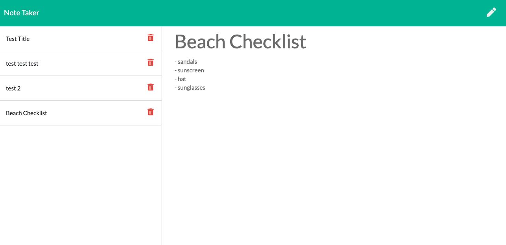

# Do Not Forget

Demo link: (https://donotforget.herokuapp.com/)

## Description

    This is a list application that I can use to help keep on track of small tasks that i need to remember or do each day. In the future i'd like to implement the delete item route on the backend.

## Built With

* [node.js](https://nodejs.org/en/)

* [Heroku](https://heroku.com)

* [Express](https://expressjs.com/)

* [javascript](https://developer.mozilla.org/en-US/docs/Web/javascript)

## Screenshot

## Contributers

    William Farnsworth - [Github](https://github.com/Cynwise)
